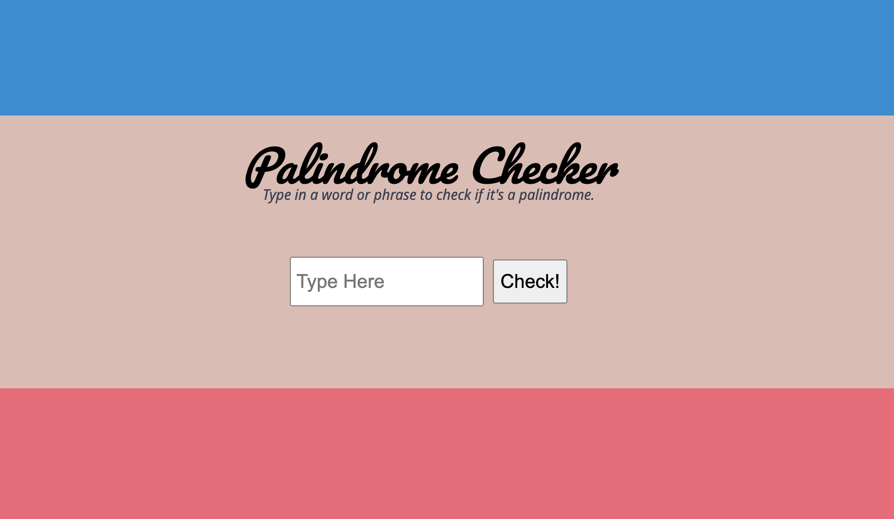

# Palindrome Checker(Node)

_This app checks if an inputted word is a palindrome by sending it to a node server and returning the answer._

<a style="text-align:center" href="https://node-palindrome-bootcamp-ujcx.onrender.com/">Here is the rendered project</a>

 

## How It's Made:

_Tech used: HTML, CSS, JavaScript, Node.js_

When the user enters in a word and presses the button. The word is passed as a query parameter into the server's API. The server does the calculation of checking if the word matches itself reversed and passes back the result, which is then displayed on the screen as a tastefully displayed alert, couresy of <a href="https://codepen.io/alvarotrigo/pen/BaVBpYj">Alvaro</a>.

## Lessons Learned:

With this project, I dove into how to setup a Node server and an API. I also learned about the process of optimizing code. First, get it done. Then, and this is very important, get it *readable.* Working in a team, more people than myself are going to read the code, so I have to put an emphasis on helping people try to decipher it and more time working with it. Even for myself, I can look at it a month from now and not know what the heck is going on. Making the code reasonably succinct and well documented will help in the long run.

### More Projects:
<a href="https://github.com/godwinKamau/matching-card">Matching Card Game</a>

<a href="https://github.com/godwinKamau/complex-api">Using APIs to expand my music tastes</a>